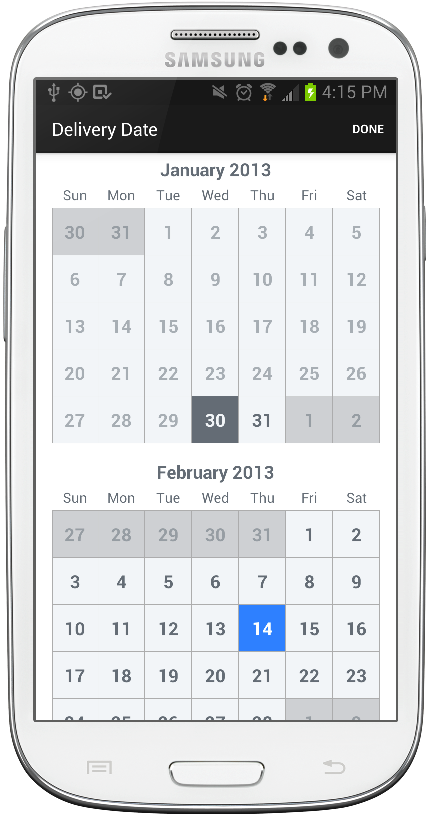

TimesSquare for Android
==========================

Standalone Android widget for picking a single date from a calendar view.




Usage
-----

Include `CalendarPickerView` in your layout XML.

```xml
<com.squareup.timessquare.CalendarPickerView
    android:id="@+id/calendar_view"
    android:layout_width="match_parent"
    android:layout_height="match_parent"
    />
```

This is a fairly large control so it is wise to give it ample space in your layout. On small
devices it is recommended to use a dialog, full-screen fragment, or dedicated activity. On larger
devices like tablets, displaying full-screen is not recommended. A fragment occupying part of the
layout or a dialog is a better choice.

In the `onCreate` of your activity/dialog or the `onCreateView` of your fragment, initialize the
view with a range of valid dates as well as the currently selected date.

```java
Calendar nextYear = Calendar.getInstance();
nextYear.add(Calendar.YEAR, 1);

CalendarPickerView calendar = (CalendarPickerView) findViewById(R.id.calendar_view);
Date today = new Date();
calendar.init(today, nextYear.getTime())
    .withSelectedDate(today);
```

The default mode of the view is to have one selectable date.  If you want the user to be able to
select multiple dates or a date range, use the inMode() method:

```java
calendar.init(today, nextYear.getTime())
    .inMode(RANGE);
```


Download
--------

The latest version can be downloaded in [zip][zip] and referenced by your application as a library
project.

You can also depend on the library through Maven:
```xml
<dependency>
  <groupId>com.squareup</groupId>
  <artifactId>android-times-square</artifactId>
  <version>1.6.4</version>
  <type>apklib</type>
</dependency>
```
or Gradle:
```groovy
compile 'com.squareup:android-times-square:1.6.4@aar'
```

Snapshots of the development version are available in [Sonatype's `snapshots` repository][snap].


License
-------

    Copyright 2012 Square, Inc.

    Licensed under the Apache License, Version 2.0 (the "License");
    you may not use this file except in compliance with the License.
    You may obtain a copy of the License at

       http://www.apache.org/licenses/LICENSE-2.0

    Unless required by applicable law or agreed to in writing, software
    distributed under the License is distributed on an "AS IS" BASIS,
    WITHOUT WARRANTIES OR CONDITIONS OF ANY KIND, either express or implied.
    See the License for the specific language governing permissions and
    limitations under the License.


 [zip]: https://github.com/square/android-times-square/archive/master.zip
 [snap]: https://oss.sonatype.org/content/repositories/snapshots/
